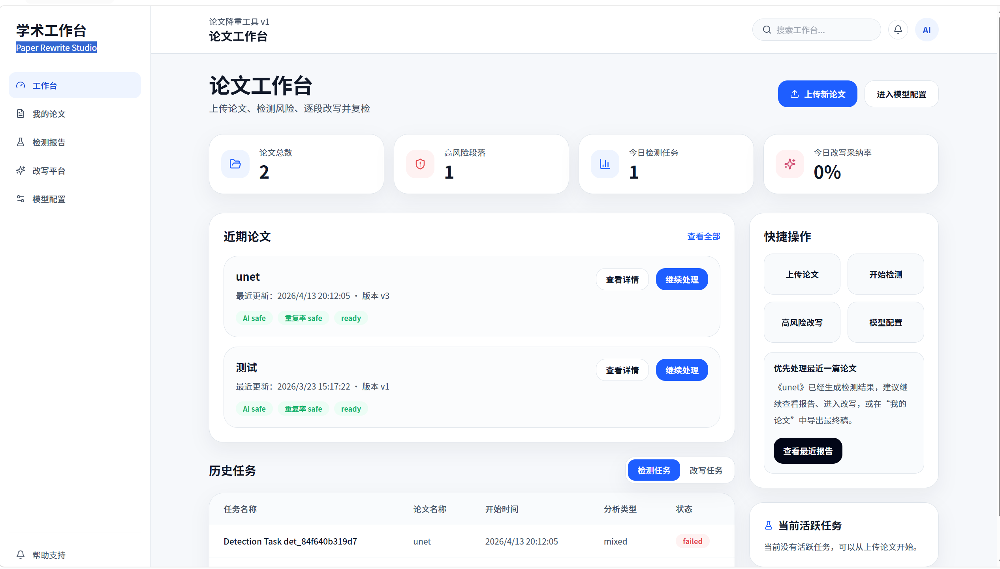
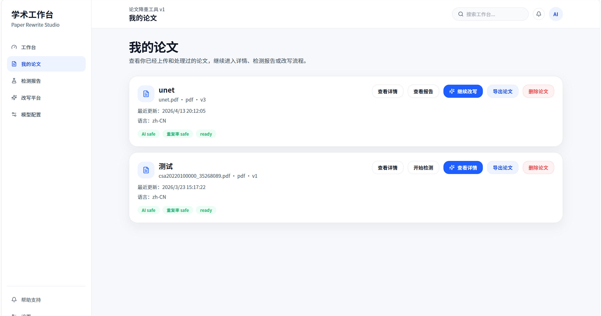
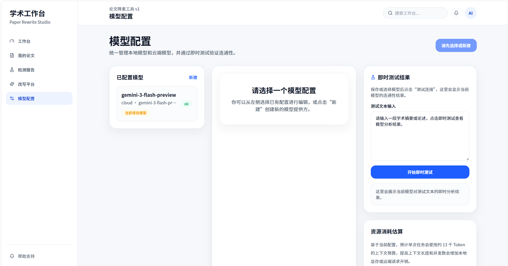

# 论文降重工具 v1

面向学生、研究者与学术写作者的本地论文优化工作台。项目围绕“上传 -> 排除范围 -> 检测 -> 改写 -> 复检 -> 导出”这条闭环流程构建，强调可解释、可控制、可回退，而不是只给一个黑盒结果。

## 界面展示

### 工作台首页



### 我的论文



### 模型配置



## 项目定位

- 适合需要对论文进行相似性风险排查、AIGC 风险排查、段落级改写和复检的本地单人使用场景。
- 适合想保留术语、引用和原始结构，只替换特定风险段落的论文优化流程。
- 不定位为“保证过审”工具，也不承诺将结果降到某个固定阈值。

## 核心能力

- 上传 `txt`、`docx`、`pdf` 论文并自动解析结构
- 在论文详情页设置封面、目录、参考文献、附录和手动段落排除
- 发起查重与 AIGC 风险检测，查看段落级风险结果
- 进入改写台逐段比较、采纳候选版本、回退原文、手动微调
- 发起复检，对比改写前后的风险变化
- 从“我的论文”导出最终论文

导出规则：
- 只替换你在平台中已经采纳或手动修改过的段落
- 未修改段落保持原文
- 导入类型为 `txt`、`docx`、`pdf` 时，导出文件类型保持一致

## 推荐使用流程

1. 在工作台上传论文文件。
2. 进入论文详情页确认排除范围。
3. 发起检测并查看高风险段落。
4. 进入改写台，只处理需要优化的段落。
5. 采纳或手动微调后发起复检。
6. 在“我的论文”中导出最终文件。

## 界面与模块

- `工作台`：查看概览、最近论文、活跃任务和快捷入口
- `我的论文`：查看论文列表、删除论文、导出最终文件
- `论文详情页`：确认结构、设置排除范围、开始检测
- `检测报告页`：查看段落级风险、进入改写流程
- `改写平台`：逐段采纳、回退、手动微调和复检
- `模型配置`：管理本地/云端模型并测试连通性
- `帮助支持`：查看推荐流程、FAQ、使用提醒与本地文档入口

## 技术栈

- 前端：React、Vite、TypeScript、React Router、TanStack Query、Tailwind CSS
- 后端：NestJS、Prisma、SQLite
- 导出：`txt`、`docx`、`pdf`

## 项目结构

- `frontend`：React + Vite 前端
- `backend`：NestJS + Prisma 后端
- `docs`：产品、设计、测试与交接文档

## 本地启动

### 1. 安装依赖

```bash
npm install
```

推荐 Node 版本：

- `Node 20` 或 `Node 22`
- 当前仓库已兼容 Windows 下中文/空格路径环境；如果你本机使用 `Node 24`，前端构建脚本会自动回退到 `Node 22` 执行构建

### 2. 启动后端

```bash
npm run dev --workspace backend
```

默认地址：

- `http://localhost:3100`
- Swagger：`http://localhost:3100/api/docs`

### 3. 启动前端

```bash
npm run dev --workspace frontend
```

默认地址：

- `http://localhost:5173`

## 环境变量

### `backend/.env`

参考 [backend/.env.example](backend/.env.example)

### `frontend/.env`

参考 [frontend/.env.example](frontend/.env.example)

### 可选：PDF 导出字体

如果本机中文字体路径特殊，可设置：

```bash
EXPORT_PDF_FONT_PATH=C:\path\to\your\font.ttf
```

项目会优先读取该字体用于中文 PDF 导出。

## 当前已验证流程

已验证以下主流程可跑通：

1. 上传论文
2. 自动解析结构
3. 设置排除范围
4. 发起检测
5. 发起改写
6. 采纳候选版本或手动微调
7. 发起复检
8. 导出最终论文

## 帮助与排错

- 若页面无法获取数据，先确认后端服务是否正常启动。
- 若接口行为异常，优先查看 Swagger：`/api/docs`
- 若导出失败，优先查看后端控制台输出和本地字体配置
- 若某段不应参与检测，先检查论文详情页中的排除范围和手动排除设置

本地文档入口：

- [产品需求文档](docs/product/论文降重工具需求文档.md)
- [前端 UI 与接口说明](frontend/docs/UI设计与接口说明文档.md)
- [后端接口文档](backend/docs/后端接口文档.md)
- [自动化测试报告](docs/自动化测试报告.md)

## 使用边界

- 本工具用于辅助优化论文表达和排查风险，不替代最终人工审核。
- 改写不等于合规引用，引用、数据、术语和结论仍需作者自行核对。
- 查重分数和 AIGC 风险仅用于辅助定位问题，不应直接视为正式机构结论。
- 在提交前，建议至少完成一次复检并人工核对最终导出内容。

## 当前已知事项

- 当前环境采用 `npm workspace` 管理依赖。
- SQLite 表结构会在后端启动时自动初始化。
- 帮助支持页与 README 已对齐，使用说明、限制和导出规则保持一致。
